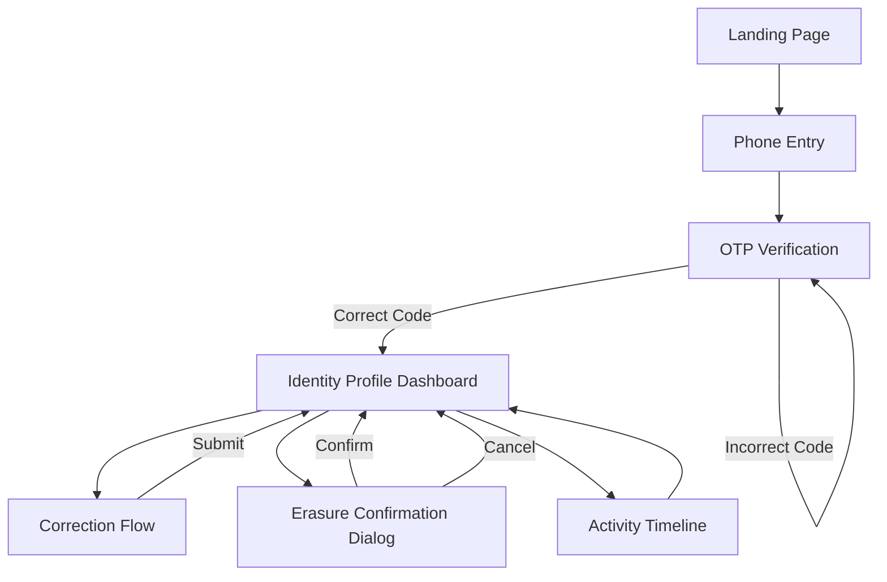
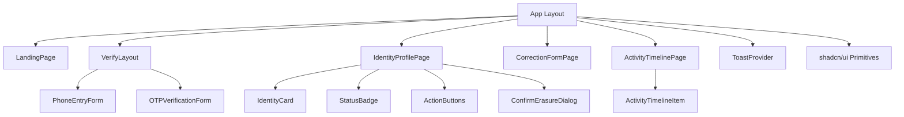
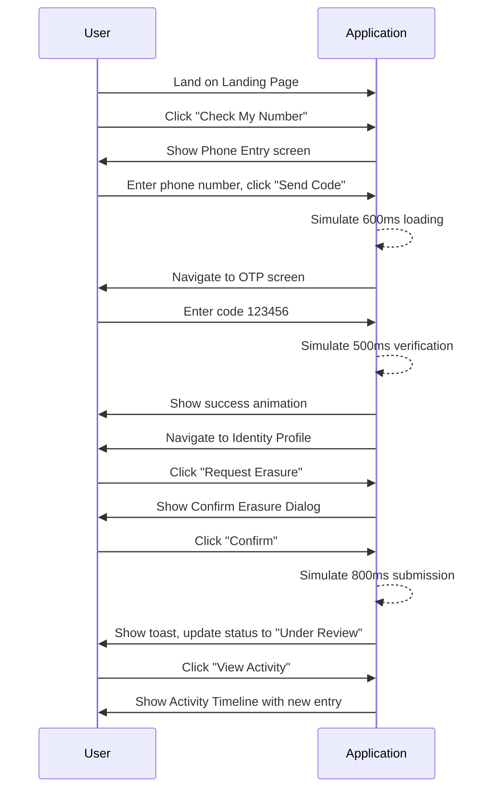

# Anti Gravity Build Guide
### Identity Rights Center — Frontend Prototype Build Specification

---

## 1. Overall Application Description

Build a frontend-only Next.js + TypeScript prototype called **Identity Rights Center**. It simulates a self-serve privacy portal where a phone number holder verifies their number via mock OTP, views an "Identity Profile" showing what data is associated with their number, and can submit a name-correction request or an erasure request. All data is local/mock — no backend, no real API calls, no authentication provider. All state transitions are simulated using local React state and `setTimeout`-based fake latency.

---

## 2. Screen Inventory

### Screen 1 — Landing Page (`/`)
- **Purpose:** Introduce the Identity Rights Center, explain its purpose, drive users into the verification flow.
- **Layout:** Full-width hero section, centered content, max-width 720px, generous vertical padding (96px top/bottom on desktop, 48px on mobile).
- **Components:** Headline (Display style), subheadline (Body Large), primary Button ("Check My Number"), ghost Button ("Learn how this works"), line-art hero illustration (Lucide-composed or simple SVG shape).
- **Navigation:** Primary button → `/verify`.
- **Interactions:** Button hover/press states per Design System. "Learn how this works" expands an inline accordion (Framer Motion height animation) with 3 short explainer points instead of navigating away.
- **Animations:** Hero content fades + slides up 16px on page load (staggered: headline, then subheadline, then buttons, 80ms stagger).
- **Mock Data:** None required.
- **Loading:** N/A (static page).
- **Success State:** N/A — this is an entry screen.

---

### Screen 2 — Phone Entry (`/verify`)
- **Purpose:** Collect and validate phone number before sending mock OTP.
- **Layout:** Centered card, max-width 440px, vertically centered in viewport.
- **Components:** Title, description, phone Input (with country code prefix "+91" fixed), primary Button ("Send Code"), inline validation message.
- **Navigation:** On valid submit → `/verify/otp`. Back arrow (top-left, Lucide `ArrowLeft`) → `/`.
- **Interactions:** Input validates on blur (10-digit numeric). Button disabled until valid.
- **Animations:** Button shows spinner (Lucide `Loader2`, rotating) for 600ms on submit before navigating.
- **Mock Data:** Accepts any valid 10-digit number; stores it in local state to display on the OTP screen.
- **Loading:** Button-level spinner only.
- **Success State:** Transitions to OTP screen.

---

### Screen 3 — OTP Verification (`/verify/otp`)
- **Purpose:** Simulate OTP-based ownership verification.
- **Layout:** Desktop: centered card, max-width 440px. Mobile: bottom sheet sliding up from bottom, 85% viewport height max.
- **Components:** Title, description showing masked phone number, 6-digit OTP input (individual boxes, auto-advance focus), resend countdown/link, primary Button ("Verify").
- **Navigation:** On correct code (`123456`) → `/profile`. Back arrow → `/verify`.
- **Interactions:** Auto-focus first box on mount. Auto-advance to next box on digit entry. Backspace moves focus back. Incorrect code triggers shake animation (Framer Motion `x: [0,-8,8,-8,0]`) + inline error text below the OTP row.
- **Animations:** Success state shows a checkmark draw-in animation (SVG path animation, 400ms) before auto-navigating after 800ms delay.
- **Mock Data:** Correct code is hardcoded as `123456`; any other 6-digit entry triggers the error state.
- **Loading:** "Verify" button shows spinner for 500ms simulated network delay before validating code.
- **Success State:** Green checkmark animation → auto-redirect to `/profile`.

---

### Screen 4 — Identity Profile Dashboard (`/profile`)
- **Purpose:** Show the verified user's current identity data as known to the platform (mock), and provide entry points to correction/erasure actions.
- **Layout:** Two-column on desktop (Identity Card left/main, Quick Stats + Actions sidebar right); single column stacked on mobile.
- **Components:**
  - Elevated Identity Card: Display Name, phone number (masked), Spam Classification badge, "Times Looked Up" stat, "Last Updated" caption.
  - Action buttons: "Edit Name" (secondary), "Request Erasure" (destructive-styled, but not alarmist in tone).
  - Status badge showing current request status if one exists (Pending / Under Review / Resolved).
  - Link to "View Activity" → `/activity`.
- **Navigation:** "Edit Name" → `/correction`. "Request Erasure" → opens Confirm Erasure Dialog in-place (no navigation). "View Activity" → `/activity`.
- **Interactions:** Card entrance animation (fade + scale from 0.98 → 1, 300ms). Hover elevation increase on card.
- **Animations:** Status badge cross-fades when its value changes (e.g., after simulated resolution).
- **Mock Data:** Pulled from `mock.json` → `identityProfile` object (see Section 6).
- **Loading:** Skeleton card shown for 500ms simulated fetch on first mount.
- **Success State:** Fully populated Identity Card as described above.

---

### Screen 5 — Correction Flow (`/correction`)
- **Purpose:** Let the user submit a corrected display name for review.
- **Layout:** Centered card, max-width 480px.
- **Components:** Title, current name (read-only reference text), new name Input, helper caption, primary Button ("Submit for Review"), Cancel ghost button.
- **Navigation:** On submit → returns to `/profile` with a toast and updated status badge ("Under Review"). Cancel → `/profile`.
- **Interactions:** Input required, non-empty, min 2 characters.
- **Animations:** Card slide-in from right (desktop) or bottom sheet (mobile).
- **Mock Data:** Updates local state `identityProfile.displayName` optimistically to "Pending" visual treatment (italic + pending badge) until "resolved" simulation completes.
- **Loading:** Submit button spinner, 700ms simulated.
- **Success State:** Toast "Your correction has been submitted for review." + redirect to `/profile`.

---

### Screen 6 — Erasure Confirmation Dialog (modal, triggered from `/profile`)
- **Purpose:** Ensure informed, deliberate consent before requesting erasure; explain trade-offs plainly.
- **Layout:** Centered modal, max-width 480px, scrim background.
- **Components:** Title, explanatory body text (trade-off language from Design System), Cancel button (secondary), Confirm button (destructive).
- **Navigation:** Confirm → closes dialog, updates `/profile` status to "Under Review," shows toast. Cancel → closes dialog, no state change.
- **Interactions:** Confirm button not pre-focused (prevents accidental Enter-key confirmation).
- **Animations:** Modal scale + fade entrance/exit (250ms).
- **Mock Data:** Updates `identityProfile.status` to `"under_review"` and adds an entry to `activityTimeline`.
- **Loading:** Confirm button spinner, 800ms simulated.
- **Success State:** Toast "Your erasure request has been submitted and is under review." Dialog closes, profile status badge updates.

---

### Screen 7 — Activity Timeline (`/activity`)
- **Purpose:** Show a chronological history of all correction/erasure requests and their status.
- **Layout:** Full-width list/table hybrid, max-width 720px centered.
- **Components:** Page title, list of Activity Timeline Rows (icon + description + timestamp + status badge), empty state block if no activity exists.
- **Navigation:** Back arrow → `/profile`.
- **Interactions:** Rows are static (no drill-down needed for happy path).
- **Animations:** Rows fade/slide in with 40ms stagger on mount.
- **Mock Data:** `activityTimeline` array from `mock.json`.
- **Loading:** Skeleton rows (3 placeholder rows) for 400ms simulated fetch.
- **Success State:** Populated timeline, most recent entry first.
- **Empty State:** Illustration + "No activity yet" + caption, per Design System.

---

## 3. Navigation Flow



---

## 4. Component Hierarchy



---

## 5. Happy Path Flow



---

## 6. Complete Mock JSON

```json
{
  "users": [
    {
      "id": "usr_001",
      "phoneNumber": "9876543210",
      "maskedPhoneNumber": "+91 98765 XXXXX",
      "isVerified": true
    }
  ],
  "identityProfile": {
    "userId": "usr_001",
    "displayName": "Rekha Menon",
    "pendingDisplayName": null,
    "spamScore": {
      "label": "Not Spam",
      "level": "safe",
      "reportCount": 0
    },
    "timesLookedUp": 128,
    "lastUpdated": "2026-05-14T10:32:00Z",
    "consentStatus": "unverified_but_unflagged",
    "status": "none",
    "sourceCount": 34
  },
  "otp": {
    "correctCode": "123456",
    "resendCooldownSeconds": 30
  },
  "correctionRequests": [
    {
      "id": "corr_001",
      "userId": "usr_001",
      "previousName": "R. Menon",
      "requestedName": "Rekha Menon",
      "status": "resolved",
      "submittedAt": "2026-04-02T09:15:00Z",
      "resolvedAt": "2026-04-04T11:00:00Z"
    }
  ],
  "erasureRequests": [],
  "verificationStatus": {
    "usr_001": {
      "phoneVerified": true,
      "verifiedAt": "2026-05-14T10:30:00Z"
    }
  },
  "notifications": [
    {
      "id": "notif_001",
      "type": "info",
      "message": "Your code has been resent.",
      "timestamp": "2026-05-14T10:29:00Z"
    }
  ],
  "activityTimeline": [
    {
      "id": "act_003",
      "type": "correction",
      "description": "Correction request submitted: name updated to 'Rekha Menon'",
      "status": "resolved",
      "timestamp": "2026-04-02T09:15:00Z"
    },
    {
      "id": "act_002",
      "type": "verification",
      "description": "Number verified successfully",
      "status": "resolved",
      "timestamp": "2026-03-28T14:02:00Z"
    },
    {
      "id": "act_001",
      "type": "system",
      "description": "Identity profile first indexed",
      "status": "resolved",
      "timestamp": "2026-01-10T08:00:00Z"
    }
  ]
}
```

---

## 7. State Management

### Global State (React Context or Zustand-style local store)
- `currentUser`: phone number, verification status.
- `identityProfile`: mutable object updated by correction/erasure actions.
- `activityTimeline`: array, appended to on each action.
- `toast`: current toast message/type, auto-clears after 4s.

### Per-Screen States

| Screen | Loading | Empty | Success | Failure |
|---|---|---|---|---|
| Landing Page | N/A | N/A | Static content rendered | N/A |
| Phone Entry | Button spinner on submit | N/A | Navigates to OTP screen | Inline validation error for invalid number |
| OTP Verification | Button spinner on verify | N/A | Checkmark animation → redirect | Shake + inline error for wrong code |
| Identity Profile | Skeleton card (500ms on mount) | N/A (profile always exists in mock) | Populated Identity Card | N/A (no failure case in happy path) |
| Correction Flow | Button spinner on submit | N/A | Toast + redirect to profile | Inline validation if name field empty |
| Erasure Dialog | Button spinner on confirm | N/A | Toast + dialog closes + status updates | N/A (happy path only) |
| Activity Timeline | Skeleton rows (400ms on mount) | Empty-state illustration if `activityTimeline.length === 0` | Populated list, newest first | N/A |

---

## 8. Interaction Specification

**Flow A — Full Verification to Erasure**
```
Click "Check My Number" (Landing)
  ↓
Navigate to Phone Entry
  ↓
Enter number → Click "Send Code"
  ↓
Loading (600ms)
  ↓
Navigate to OTP Screen
  ↓
Enter "123456"
  ↓
Loading (500ms)
  ↓
Success checkmark animation (400ms)
  ↓
Auto-navigate to Identity Profile (after 800ms)
  ↓
Profile loads with Skeleton (500ms) → populated Identity Card
  ↓
Click "Request Erasure"
  ↓
Confirm Erasure Dialog opens
  ↓
Click "Confirm"
  ↓
Loading (800ms)
  ↓
Toast: "Your erasure request has been submitted and is under review."
  ↓
Dialog closes → Status Badge updates to "Under Review"
  ↓
Click "View Activity"
  ↓
Activity Timeline loads with Skeleton (400ms) → shows new entry at top
```

**Flow B — Correction Path**
```
From Identity Profile → Click "Edit Name"
  ↓
Navigate to Correction Flow
  ↓
Enter new name → Click "Submit for Review"
  ↓
Loading (700ms)
  ↓
Toast: "Your correction has been submitted for review."
  ↓
Navigate back to Identity Profile
  ↓
Display Name shown with "Pending" treatment + Status Badge "Under Review"
```

---

## 9. Anti Gravity Build Instructions

Build this application using:

- **Next.js** (App Router, TypeScript)
- **TailwindCSS** for all styling, using CSS variables defined in `DESIGN_SYSTEM.md`
- **shadcn/ui** for base primitives (Button, Input, Dialog, Badge, Toast, Skeleton)
- **Framer Motion** for all transitions, page animations, and micro-interactions specified above
- **Lucide Icons** exclusively for all iconography
- **Local mock JSON** (Section 6) as the only data source, loaded via a local state/context provider
- **No backend** — do not create API routes that call external services
- **No authentication** — OTP verification is fully simulated client-side
- **No real network calls** — all "loading" states are simulated via `setTimeout`

All copy must match `DESIGN_SYSTEM.md` exactly. Do not invent placeholder or lorem ipsum text anywhere in the build.

---

## 10. Final Checklist

- [ ] Every screen in Section 2 is built and connected per the Navigation Flow diagram
- [ ] Every button performs its specified action (no dead-end buttons)
- [ ] Every flow in Section 8 is fully clickable end-to-end
- [ ] Application is responsive across mobile, tablet, and desktop breakpoints
- [ ] Visual design matches `DESIGN_SYSTEM.md` tokens exactly (colors, spacing, radius, typography)
- [ ] All specified animations and transitions are implemented (Framer Motion)
- [ ] Design reads as a premium, production-quality application — not a wireframe
- [ ] No placeholder text or lorem ipsum anywhere
- [ ] No missing icons — every icon reference uses an actual Lucide icon
- [ ] No incomplete or dead-end screens — every navigational path in Section 3 resolves correctly
- [ ] All loading, empty, success, and failure states from Section 7 are implemented and visually distinct
