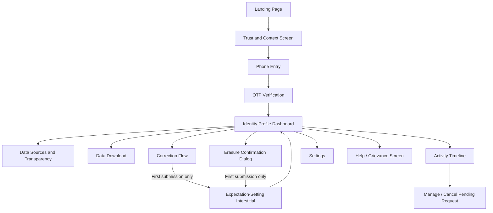

# Anti Gravity Enhancements
### Identity Rights Center — Additions to Elevate from 9/10 to 10/10

This document contains **only additions**. It assumes `README.md`, `DESIGN_SYSTEM.md`, and `ANTI_GRAVITY_BUILD_GUIDE.md` are already fully implemented. Nothing here replaces or contradicts those files — everything below layers on top.

---

## 1. Missing Screens (Add These)

### 1.1 — Trust & Context Screen (`/verify/intro`)
Inserted between Landing Page and Phone Entry. A single screen, three short beats (icon + one line each), explaining: *why* Truecaller has data on this number, *what* the user is about to do, and *what happens after* they submit a request. This single screen does more for trust than any amount of copy on the Phone Entry screen itself — it front-loads context instead of asking for a phone number cold.
- **Layout:** Same centered-card pattern as Phone Entry, three-row icon list, primary button "Continue," ghost button "Skip."
- **Copy:**
  - "Your number may be listed based on how others have saved it in their contacts."
  - "We'll verify it's really yours with a one-time code."
  - "Any changes you request go through a short review — never applied instantly."

### 1.2 — Expectation-Setting / SLA Screen (shown once, after first submission)
A lightweight interstitial (not a dialog) shown the very first time a user submits *any* request, before returning them to the profile. Sets a concrete SLA and next steps so silence after submission doesn't read as the product "swallowing" the request.
- **Copy:** "Here's what happens next" → "Most requests are reviewed within 3–5 business days. You'll see status updates right here — no need to check anywhere else."

### 1.3 — Data Sources & Transparency Screen (`/profile/sources`)
Linked from the Identity Profile via a "Where does this come from?" link near the source count stat. Shows an anonymized, aggregated breakdown (e.g., "34 contact uploads," "0 business directories," "Last contributing upload: 2 weeks ago") without exposing any individual's identity. This is the single highest-leverage addition for DPDP-style transparency and is exactly the kind of screen a reviewer will remember.

### 1.4 — Data Download / Portability Screen (`/profile/download`)
A simple screen offering "Download a copy of your data" (JSON/PDF mock), satisfying the data-portability expectation without needing erasure. Include a disabled-but-visible "Request Download" button with a "We'll email this to your verified number's linked contact" caption (mock only).

### 1.5 — Manage / Cancel Pending Request Screen
Accessible from the Activity Timeline row itself when status is "Under Review." Lets the user view full request details and cancel it before resolution. Without this, a "Pending" state feels like a one-way door, which undercuts the product's "you're in control" promise.

### 1.6 — Error / Failure Screen (Generic)
A dedicated full-screen state for simulated network/server failure (e.g., triggered via a hidden dev toggle for demo purposes), with a retry button and calm, non-alarming copy: "Something didn't go through. Nothing has changed — you can try again." Every flow in the current spec only has success states; a premium prototype should visibly demonstrate it has *considered* failure, even in a happy-path build.

### 1.7 — Help / Grievance Contact Screen (`/help`)
A minimal screen linked from the global footer: FAQ accordion (3–4 items) + a "Contact Grievance Officer" mock button. This directly reflects the DPDP grievance-redressal requirement and is an easy, high-signal addition for the interview discussion.

---

## 2. Missing Interactions

- **OTP paste support:** Detect a pasted 6-digit string and auto-fill all boxes at once, not just single-digit typing.
- **Cancel-in-flight requests:** From the new Manage/Cancel screen (1.5), allow cancelling a pending correction or erasure request, reverting status to "None" with a confirmation toast.
- **Inline "Undo" window on submission:** After submitting an erasure or correction, show a toast with an "Undo" action (5-second window) before the request is treated as officially logged — a premium, forgiving pattern that prevents anxiety around irreversible-feeling actions.
- **Progressive disclosure on the Erasure dialog:** Collapse the trade-off explanation behind a "What does this mean?" expandable row by default, with the core question and two buttons visible immediately — reduces cognitive load while keeping transparency one tap away.
- **Persistent step indicator during verification:** A small "Step 1 of 2" / "Step 2 of 2" label pinned above the Phone Entry and OTP cards, so the user always has orientation.

---

## 3. Missing Microinteractions

- **Animated count-up** on "Times Looked Up" stat when the Identity Profile first loads (0 → 128 over ~600ms, ease-out).
- **Icon morph on status change:** Status badge icon smoothly cross-fades/morphs (e.g., clock icon → checkmark icon) rather than swapping instantly when a request resolves.
- **Button label state changes:** Buttons show contextual in-progress labels, not just a spinner — e.g., "Send Code" → "Sending…" → "Sent," "Submit for Review" → "Submitting…".
- **Phone number auto-formatting:** As the user types, format the input as "98765 43210" rather than a raw digit string.
- **Timeline connector fill animation:** In the new Manage Request screen, a vertical progress line between "Submitted → Under Review → Resolved" fills incrementally as the mock timestamp progresses, rather than being a flat list.

---

## 4. Missing Delight

- **Context-aware empathetic microcopy:** A single warm, human line on the Identity Profile the first time it loads: "This is your data, presented clearly — take your time." Small, not gimmicky, consistent with the "calm authority" brand personality already defined.
- **First-resolution acknowledgment:** When a request is simulated as "Resolved" for the first time in a session, show a brief, quiet toast (not a celebration burst): "Done — your identity data has been updated." Understated delight that matches the brand tone, rather than confetti or gamified celebration, which would clash with the "unhurried, never alarmist" personality.
- **Time-aware greeting on return visits:** If `activityTimeline` is non-empty on load, greet returning verified users with "Welcome back" instead of the generic profile header — makes the mock feel like a persistent, living product rather than a one-shot demo.

---

## 5. Missing Trust Signals

- **Verification badge:** A small "Verified" checkmark chip next to the phone number on the Identity Profile once OTP is confirmed — reinforces that the action they took *mattered* and is visibly reflected back.
- **Persistent footer trust bar:** On every screen post-verification, a slim footer with: privacy policy link, "How your data is handled" link, and the Help/Grievance screen link (1.7). This single element does more for perceived legitimacy than any individual page.
- **Human-review indicator:** Add a line to both the Correction and Erasure confirmation moments: "Reviewed by our Trust & Safety team — not fully automated." This is a meaningful trust signal specifically because it counters the fear that erasure requests vanish into an algorithmic void.
- **Session security indicator:** A small lock icon + "Secured session" caption near the OTP input, reinforcing that this sensitive step is protected.

---

## 6. Missing Onboarding

- **Three-step visual progress ribbon** shown once on first entry to the whole product (Landing Page), previewing the three big phases: Verify → Review Your Data → Take Action. This can be a simple horizontal 3-icon strip beneath the hero, not a separate screen — sets expectations before any commitment is asked of the user.
- **Coach mark on first Identity Profile visit:** A single, dismissible tooltip pointing at "Request Erasure," clarifying: "This is always available — nothing is locked behind a paywall or extra steps." Directly pre-empts a skeptical reviewer's question about dark patterns.

---

## 7. Missing Accessibility

- **Reduced motion support:** All Framer Motion transitions should check `prefers-reduced-motion` and fall back to instant/opacity-only transitions.
- **Live region announcements:** Status badge changes and toast messages should be wrapped in an `aria-live="polite"` region so screen readers announce state changes (e.g., "Status updated to Under Review") without requiring focus movement.
- **Focus trap + return-focus on dialogs:** Confirm Erasure and Confirm Correction dialogs must trap focus while open and return focus to the triggering button on close.
- **Non-color status differentiation:** Every status badge must pair its color with a distinct icon shape (clock for Pending, eye for Under Review, check for Resolved) so status is never conveyed by color alone.
- **Skip-to-content link:** Add a visually-hidden "Skip to main content" link at the top of every page for keyboard users.

---

## 8. Missing Transparency

- **Retention explainer:** One line, visible on the Data Sources screen (1.3): "Identity data is retained only while your number remains active in the network. Erasure requests are typically processed within 5 business days."
- **"What counts as a source" explainer tooltip:** Clarify in plain language on the Identity Profile that "source count" refers to anonymized contact-book uploads, never revealing identities of individual uploaders — an important distinction to state explicitly rather than leave implicit.
- **Review SLA visible at submission, not just after:** Surface the "reviewed within 3–5 business days" line directly inside the Erasure/Correction confirmation dialogs themselves, not only in the one-time interstitial (1.2), so it's visible every time, not just the first.

---

## 9. Missing Visual Hierarchy

- **Elevate "Times Looked Up" and "Spam Classification" as the two dominant stats** on the Identity Profile (larger type, top of card), with "Last Updated" and "Source Count" demoted to smaller caption-style metadata below a divider — currently all fields are specified at equal visual weight, which flattens the card's priority.
- **Sticky mini-header during scroll on Activity Timeline and Data Sources screens**, showing the page title and a condensed back action, so long lists don't lose page context.
- **Verification badge as a visual anchor** (see Section 5) — gives the profile card a clear focal point beyond plain text fields.

---

## 10. Missing Animations

- **Route-level top progress bar** (thin, primary-colored, YouTube/Next.js-style) on every navigation, reinforcing perceived performance and polish across the whole app, not just within individual screens.
- **Directional page transitions:** Forward navigation slides content in from the right / fades up; backward navigation (via back arrow) reverses the direction — currently all transitions are specified as one uniform fade, which reads as flat in a real click-through.
- **Status stepper fill animation:** The new Manage Request screen's vertical connector line (Section 3) animates its fill using a spring easing consistent with the rest of the motion system.

---

## 11. Missing Empty States

- **Empty state for "Data Sources" screen** if a number has zero contributing uploads (e.g., a freshly ported number): illustration + "No data linked yet — check back later" — this scenario is entirely uncovered in the current spec.
- **Empty state for Spam Classification** when a number has no classification history yet: "Not enough data yet" badge variant, distinct from "Not Spam," so a lack of data is never visually indistinguishable from a positive safety signal.

---

## 12. Missing Loading States

- **Global route-transition loading bar** (pairs with Section 10) — a consistent top-of-viewport loading indicator for all navigations, not just per-component skeletons.
- **Optimistic UI on Correction submission:** Show the new name immediately in the Identity Card (marked with a "Pending" visual treatment) the instant the user submits, rather than only updating after the simulated 700ms delay resolves — makes the interaction feel instantaneous while still honestly representing the review-pending state.

---

## 13. Missing Premium UX Patterns

- **Visual status stepper** (Submitted → Under Review → Resolved) replacing the flat badge-only status treatment on the Manage Request screen (1.5) — this single pattern is one of the highest-impact, most "premium fintech app" signals available and is currently entirely absent from the spec.
- **Settings screen** (`/settings`) with a dark mode toggle exposed in the UI (dark mode tokens exist in `DESIGN_SYSTEM.md` but no control currently surfaces them) and a notification-preference mock toggle ("Notify me by SMS when a request is resolved").
- **Lightweight CSAT micro-survey** after a request resolves: a single-tap "Was this clear?" thumbs up/down, shown once per resolution, never blocking navigation — signals product maturity and a feedback loop without adding real friction.
- **Multi-number management (future-facing but worth stubbing):** A simple "+ Check another number" entry point from the Identity Profile, demonstrating the product's scalability beyond a single-number demo without needing to fully build it out.

---

## 14. Updated Navigation Flow (Additions Only)



---

## 15. Mock Data Additions

```json
{
  "identityProfile": {
    "isVerifiedBadgeVisible": true,
    "spamScore": {
      "hasSufficientData": true
    }
  },
  "dataSources": {
    "totalContributingUploads": 34,
    "businessDirectoryMatches": 0,
    "lastContributingUploadDate": "2026-06-20T00:00:00Z"
  },
  "settings": {
    "darkModeEnabled": false,
    "smsNotificationsEnabled": true
  },
  "helpFaq": [
    {
      "question": "Why does Truecaller have my number if I never signed up?",
      "answer": "Numbers can be added to the network when someone who has you saved as a contact uploads their contact list."
    },
    {
      "question": "How long does a review take?",
      "answer": "Most correction and erasure requests are reviewed within 3–5 business days."
    },
    {
      "question": "Can I cancel a request after submitting it?",
      "answer": "Yes — pending requests can be cancelled any time before they're resolved."
    }
  ],
  "csatResponses": []
}
```

---

## 16. Priority Guidance for Anti Gravity

If time-constrained, implement in this order for maximum perceived-quality gain per unit of build effort:

1. Status Stepper (Section 13) + Manage/Cancel Request Screen (1.5)
2. Trust & Context Screen (1.1) + Persistent Footer Trust Bar (Section 5)
3. Route-level loading bar + directional transitions (Sections 10, 12)
4. Data Sources & Transparency Screen (1.3)
5. Everything else, as time allows
